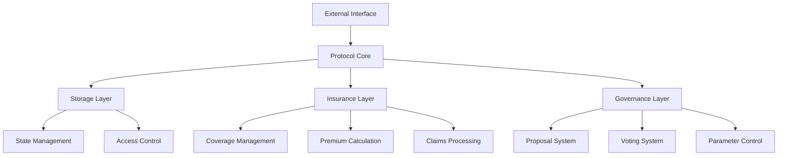
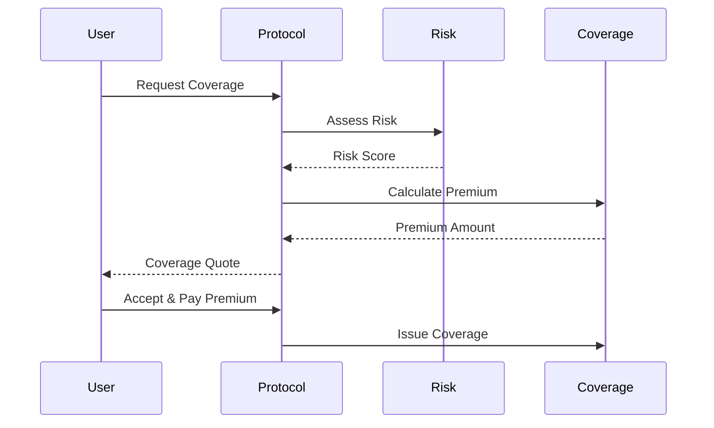
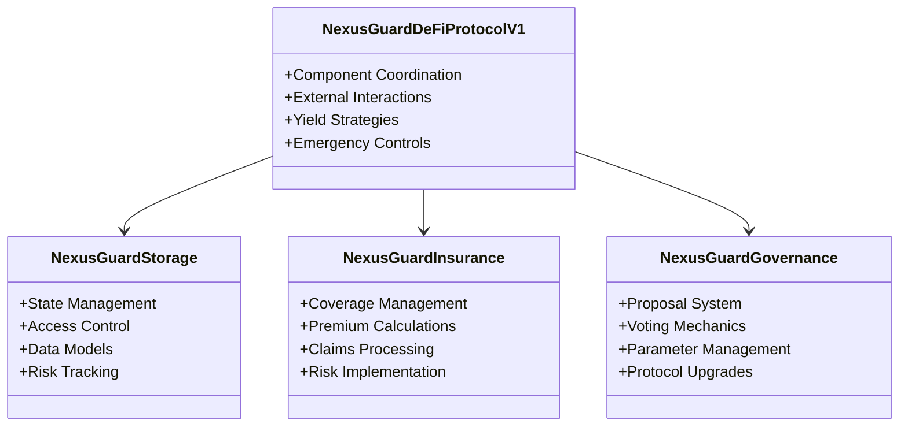

# NexusGuard Protocol

> Decentralized insurance protocol for DeFi projects on Sonic blockchain


## Overview

NexusGuard is a decentralized insurance protocol that provides comprehensive coverage against smart contract vulnerabilities and technical failures for DeFi projects. Built on Sonic blockchain, it implements advanced risk assessment models and dynamic premium calculations.

## Features

- 🔒 **Smart Contract Coverage**: Protection against vulnerabilities and exploits
- 📊 **Dynamic Risk Assessment**: Real-time risk monitoring and automated adjustments
- 💰 **Yield Generation**: Efficient capital utilization through ERC4626 vaults
- 🏛️ **Decentralized Governance**: Community-driven protocol management
- 🛡️ **Multi-layer Security**: Role-based access control and circuit breakers


## Architecture






### Core Contracts

| Contract | Description |
|----------|-------------|
| `NexusGuardStorage.sol` | State and access management |
| `NexusGuardInsurance.sol` | Coverage and premium calculations |
| `NexusGuardGovernance.sol` | Protocol governance |
| `NexusGuardDeFiProtocolV1.sol` | Core protocol logic |
```


### Core Contracts



### Smart Contract Integration

```solidity
interface INexusGuard {
    function requestCoverage(
        address project,
        uint256 amount,
        uint256 duration
    ) external returns (uint256 premiumRequired);
    
    function purchaseCoverage(
        uint256 coverageId,
        uint256 premium
    ) external returns (bool);
}
```

### Protocol Parameters

<div align="center">

| Parameter | Value |
|:---------:|:-----:|
| 💎 **Minimum Coverage** | 1,000 GUARD |
| 💰 **Maximum Coverage** | 10,000,000 GUARD |
| ⏱️ **Coverage Duration** | 30-365 days |
| 📊 **Base Premium Rate** | 1-5% |
| 🎯 **Target Utilization** | 80% |

</div>

### Security Features

<div align="center">

| Feature | Status |
|:--------|:------:|
| 🔐 Comprehensive Security Audits | ✅ |
| ⏰ Time-locked Admin Functions | ✅ |
| 🛑 Emergency Pause Functionality | ✅ |
| 🔑 Multi-signature Requirements | ✅ |
| 🛡️ Regular Vulnerability Assessments | ✅ |

</div>

### Documentation & Resources

<div align="center">

| Resource | Link |
|:--------:|:----:|
| 📚 Documentation | [docs.nexusguard.io](https://docs.nexusguard.io) |
| 📋 Contributing Guide | [CONTRIBUTING.md](CONTRIBUTING.md) |
| ⚖️ License | [MIT License](LICENSE) |

</div>

### Connect With Us

<div align="center">

[![Website][]](https://nexusguard.io)[![Discord][]](https://discord.gg/nexusguard)[![Twitter][]](https://twitter.com/NexusGuard)

</div>
```

Connect
Website: nexusguard.io
Twitter: @NexusGuard
Discord: NexusGuard Community
