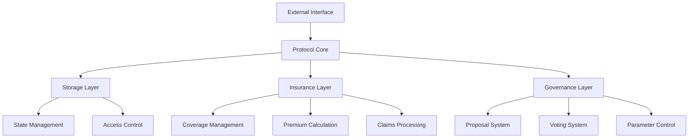
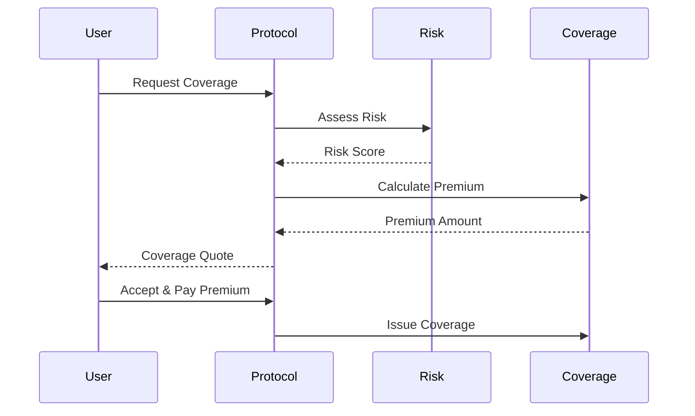
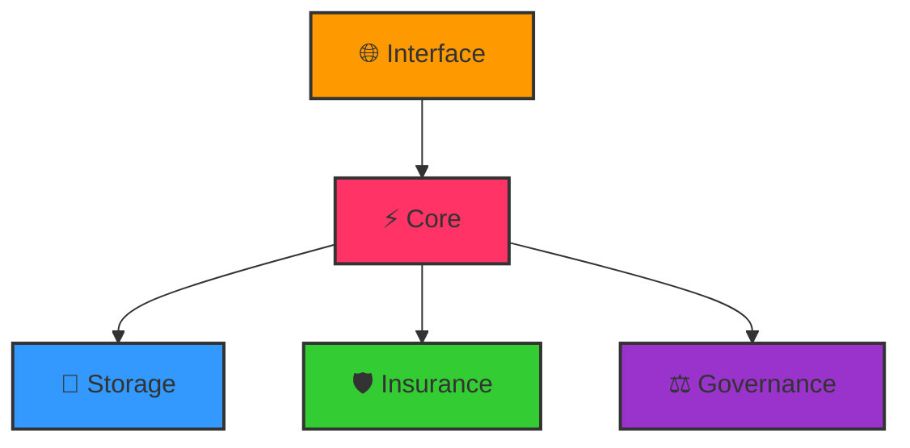
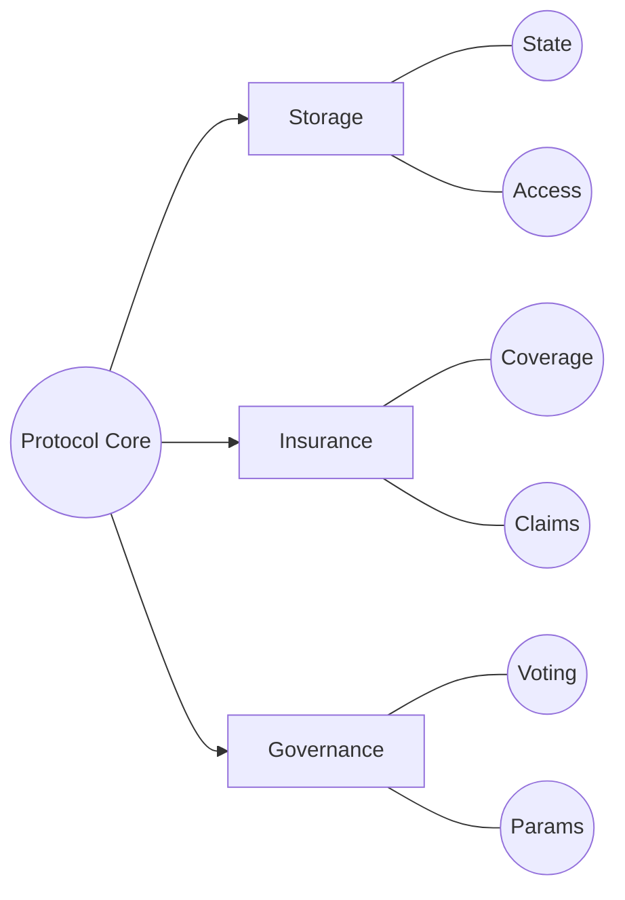
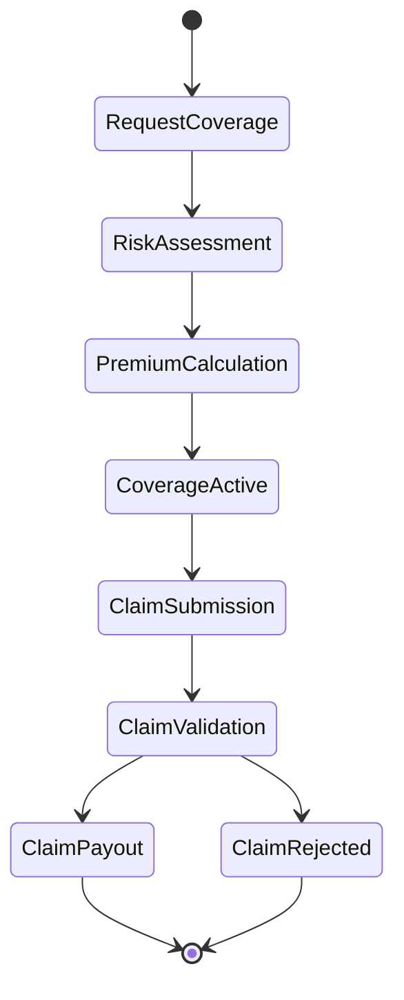
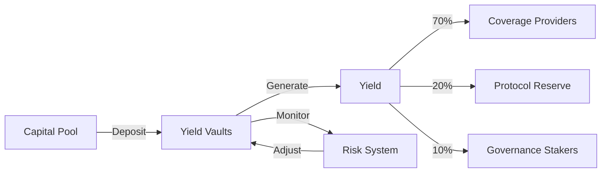
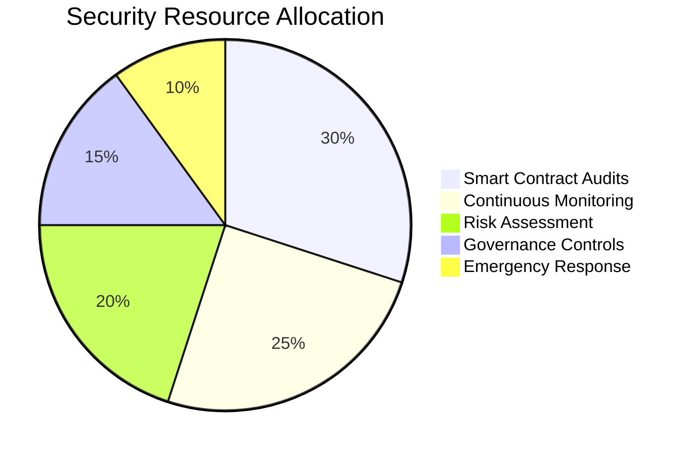
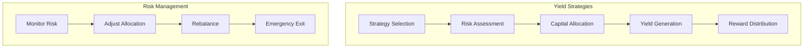

# NexusGuard Protocol

> Decentralized insurance protocol for DeFi projects on Sonic blockchain

<div align="center">
  <p align="center" style="display: flex; justify-content: center; align-items: center; gap: 10px; flex-wrap: wrap; margin: 20px 0;">
    
    
    
    
    
  </p>
</div>

## Overview

NexusGuard is a decentralized insurance protocol that provides comprehensive coverage against smart contract vulnerabilities and technical failures for DeFi projects. Built on Sonic blockchain, it implements advanced risk assessment models and dynamic premium calculations.

## Features

- 🔒 **Smart Contract Coverage**: Protection against vulnerabilities and exploits
- 📊 **Dynamic Risk Assessment**: Real-time risk monitoring and automated adjustments
- 💰 **Yield Generation**: Efficient capital utilization through ERC4626 vaults
- 🏛️ **Decentralized Governance**: Community-driven protocol management
- 🛡️ **Multi-layer Security**: Role-based access control and circuit breakers


## Architecture






```


```
## 🔮 Core Protocol Components

<div align="center">

### ⚡ Smart Contract Architecture

<table>
  <tr>
    <th width="25%" align="center">🔐 Contract</th>
    <th width="25%" align="center">💫 Function</th>
    <th width="50%" align="center">✨ Features</th>
  </tr>
  <tr>
    <td align="center">
      <b>NexusGuardStorage</b><br>
      <sub><sup>Foundation Layer</sup></sub>
    </td>
    <td align="center">
      <b>State Management</b><br>
      <sub><sup>Data & Access Control</sup></sub>
    </td>
    <td>
      <ul>
        <li>🔒 Secure Access Control System</li>
        <li>📊 Advanced Data Modeling</li>
        <li>📈 Real-time Risk Tracking</li>
      </ul>
    </td>
  </tr>
  <tr>
    <td align="center">
      <b>NexusGuardInsurance</b><br>
      <sub><sup>Coverage Layer</sup></sub>
    </td>
    <td align="center">
      <b>Coverage Systems</b><br>
      <sub><sup>Risk & Claims</sup></sub>
    </td>
    <td>
      <ul>
        <li>💰 Dynamic Premium Calculation</li>
        <li>⚖️ Automated Claims Processing</li>
        <li>📊 Risk Assessment Engine</li>
      </ul>
    </td>
  </tr>
  <tr>
    <td align="center">
      <b>NexusGuardGovernance</b><br>
      <sub><sup>Control Layer</sup></sub>
    </td>
    <td align="center">
      <b>Protocol Control</b><br>
      <sub><sup>Governance & Voting</sup></sub>
    </td>
    <td>
      <ul>
        <li>🏛️ Decentralized Voting System</li>
        <li>⚙️ Parameter Optimization</li>
        <li>📜 Proposal Management</li>
      </ul>
    </td>
  </tr>
  <tr>
    <td align="center">
      <b>NexusGuardDeFiProtocol</b><br>
      <sub><sup>Protocol Core</sup></sub>
    </td>
    <td align="center">
      <b>Core Logic</b><br>
      <sub><sup>Integration Hub</sup></sub>
    </td>
    <td>
      <ul>
        <li>🔄 Seamless Component Integration</li>
        <li>🌐 External Interface Management</li>
        <li>🔄 Upgrade Coordination System</li>
      </ul>
    </td>
  </tr>
</table>

### 🔄 Protocol Flow



### 🎯 Access Control Matrix

<table>
  <tr>
    <th width="25%" align="center">🔐 Component</th>
    <th width="25%" align="center">🔑 Access Level</th>
    <th width="25%" align="center">👥 Controllers</th>
    <th width="25%" align="center">🎭 Permissions</th>
  </tr>
  <tr>
    <td align="center">
      <b>Storage</b><br>
      <sub>Data Layer</sub>
    </td>
    <td align="center">
      <b>Restricted</b><br>
      <sub>High Security</sub>
    </td>
    <td align="center">
      <b>Admin & Core</b><br>
      <sub>System Level</sub>
    </td>
    <td align="center">
      <span>⭐⭐⭐⭐⭐</span><br>
      <sub>Maximum</sub>
    </td>
  </tr>
  <tr>
    <td align="center">
      <b>Insurance</b><br>
      <sub>Business Layer</sub>
    </td>
    <td align="center">
      <b>Public/Protected</b><br>
      <sub>Mixed Access</sub>
    </td>
    <td align="center">
      <b>Users & Core</b><br>
      <sub>Hybrid Level</sub>
    </td>
    <td align="center">
      <span>⭐⭐⭐⭐</span><br>
      <sub>High</sub>
    </td>
  </tr>
  <tr>
    <td align="center">
      <b>Governance</b><br>
      <sub>Control Layer</sub>
    </td>
    <td align="center">
      <b>Token Gated</b><br>
      <sub>Stake Based</sub>
    </td>
    <td align="center">
      <b>Community</b><br>
      <sub>DAO Level</sub>
    </td>
    <td align="center">
      <span>⭐⭐⭐</span><br>
      <sub>Medium</sub>
    </td>
  </tr>
  <tr>
    <td align="center">
      <b>Protocol</b><br>
      <sub>Core Layer</sub>
    </td>
    <td align="center">
      <b>System</b><br>
      <sub>Automated</sub>
    </td>
    <td align="center">
      <b>Autonomous</b><br>
      <sub>Code Level</sub>
    </td>
    <td align="center">
      <span>⭐⭐⭐⭐⭐</span><br>
      <sub>Maximum</sub>
    </td>
  </tr>
</table>

</div>
```


### Component Interaction



### System Overview

<div align="center">

| Layer | Function | Access Control |
|:-----:|:--------:|:-------------:|
| Storage | Data Management | Admin Only |
| Insurance | Coverage Logic | Public/Restricted |
| Governance | Protocol Control | Token Holders |
| Core | Integration | System Only |

</div>
```


### Coverage Flow



### Yield Strategy Flow



## Protocol Parameters

<div align="center">

### Coverage Parameters

| Parameter | Value | Description |
|:---------:|:-----:|:------------|
| 💎 **Minimum Coverage** | 1,000 GUARD | Minimum coverage amount per policy |
| 💰 **Maximum Coverage** | 10,000,000 GUARD | Maximum coverage per project |
| ⏱️ **Coverage Duration** | 30-365 days | Valid coverage period range |
| 📊 **Base Premium Rate** | 1-5% | Annual premium rate before adjustments |
| 🎯 **Target Utilization** | 80% | Optimal capital utilization ratio |

### Risk Parameters

| Parameter | Target | Warning | Critical |
|:---------:|:------:|:-------:|:--------:|
| **Protocol TVL** | > 10M GUARD | < 5M GUARD | < 1M GUARD |
| **Collateral Ratio** | > 150% | < 130% | < 120% |
| **Risk Exposure** | < 40% | > 50% | > 60% |
| **Category Limit** | < 30% | > 35% | > 40% |

### Governance Parameters

| Parameter | Value |
|:---------:|:-----:|
| 🏛️ **Minimum Proposal Stake** | 100,000 GUARD |
| ⏳ **Voting Period** | 7 days |
| 🔒 **Timelock Period** | 2 days |
| 📊 **Quorum Requirement** | 10% |
| 🎯 **Execution Delay** | 48 hours |

</div>

## Security Framework

### Multi-Layer Security



### Risk Assessment Matrix

<div align="center">

| Impact ↓ Likelihood → | Low | Medium | High |
|:--------------------:|:---:|:------:|:----:|
| **High** | 🟨 | 🟧 | 🟥 |
| **Medium** | 🟩 | 🟨 | 🟧 |
| **Low** | 🟩 | 🟩 | 🟨 |

</div>

## Yield Generation Strategies



## Protocol Metrics

<div align="center">

### Performance Indicators

| Metric | Target | Current |
|:------:|:------:|:-------:|
| 📈 **APY** | 15% | 12.5% |
| 💰 **TVL** | $50M | $42M |
| 🛡️ **Coverage Ratio** | 150% | 165% |
| 📊 **Utilization** | 80% | 75% |

</div>


<div align="center">
  <h1>
    
    <span style="background: linear-gradient(45deg, #FF6B6B, #4ECDC4); -webkit-background-clip: text; -webkit-text-fill-color: transparent;">
    </span>
</div>

<div style="background: linear-gradient(45deg, #1a1a1a, #2d2d2d); border-radius: 10px; padding: 20px; margin: 20px 0;">

## 🛡️ Core Integration Functions

```solidity
/// @notice Request coverage for a DeFi project
/// @param project Address of the DeFi project
/// @param amount Coverage amount requested
/// @param duration Coverage duration in days
/// @return premiumRequired Premium amount to be paid
function requestCoverage(
    address project,
    uint256 amount,
    uint256 duration
) external returns (uint256 premiumRequired);

/// @notice Purchase coverage after premium calculation
/// @param coverageId Unique identifier for coverage request
/// @param premium Amount of premium to be paid
/// @return success Boolean indicating coverage purchase success
function purchaseCoverage(
    uint256 coverageId,
    uint256 premium
) external returns (bool);

/// @notice Submit an insurance claim
/// @param coverageId Unique identifier for active coverage
/// @param amount Claim amount requested
/// @param evidence Supporting evidence for the claim
/// @return claimId Unique identifier for submitted claim
function submitClaim(
    uint256 coverageId,
    uint256 amount,
    bytes calldata evidence
) external returns (uint256 claimId);
```

</div>

## ⚡ Quick Integration Example

```solidity
// 1. Request Coverage Quote
uint256 premium = nexusGuard.requestCoverage(
    projectAddress,
    1000 ether,  // 1000 tokens coverage
    30 days
);

// 2. Purchase Coverage
bool success = nexusGuard.purchaseCoverage(
    coverageId,
    premium
);

// 3. Submit Claim (if needed)
uint256 claimId = nexusGuard.submitClaim(
    coverageId,
    500 ether,  // 500 tokens claim
    evidenceData
);
```

</div>

<div align="center">
  
</div>


