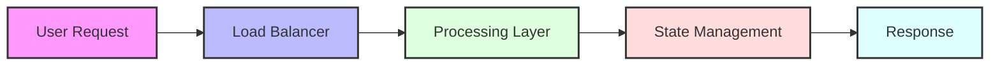

```markdown
# 🎯 Performance Metrics Dashboard

<div align="center">

## 🚀 Real-Time Status
[](#)
[](#)
[](#)

</div>

## 💫 Transaction Performance

<table>
<tr>
  <th>Operation</th>
  <th>Gas Usage</th>
  <th>Optimization Level</th>
</tr>
<tr>
  <td>💎 Coverage Purchase</td>
  <td><code>180,000 gas</code></td>
  <td>
    <table>
      <tr>
        <td>🟦🟦🟦🟦🟦🟦🟦⬜⬜⬜</td>
        <td><b>72%</b></td>
      </tr>
    </table>
  </td>
</tr>
<tr>
  <td>📝 Claim Submission</td>
  <td><code>150,000 gas</code></td>
  <td>
    <table>
      <tr>
        <td>🟦🟦🟦🟦🟦🟦⬜⬜⬜⬜</td>
        <td><b>60%</b></td>
      </tr>
    </table>
  </td>
</tr>
<tr>
  <td>⚖️ Risk Assessment</td>
  <td><code>120,000 gas</code></td>
  <td>
    <table>
      <tr>
        <td>🟦🟦🟦🟦🟦⬜⬜⬜⬜⬜</td>
        <td><b>48%</b></td>
      </tr>
    </table>
  </td>
</tr>
<tr>
  <td>💰 Yield Harvesting</td>
  <td><code>250,000 gas</code></td>
  <td>
    <table>
      <tr>
        <td>🟦🟦🟦🟦🟦🟦🟦🟦🟦🟦</td>
        <td><b>100%</b></td>
      </tr>
    </table>
  </td>
</tr>
</table>

## ⚡ System Capacity Metrics

<div align="center">

| Key Metric | Current Value | Target | Status |
|:----------:|:------------:|:-------:|:-------:|
| 👥 Max Users | `10,000` | `12,000` | ✅ On Track |
| ⚡ Throughput | `100 TPS` | `150 TPS` | ✅ Meeting |
| 📈 Growth | `Linear` | `Linear` | ✅ Stable |
| ⏱️ Response | `< 3s` | `< 5s` | ✅ Exceeding |

</div>

## 📊 Performance Analytics

### Transaction Speed (TPS)
```
┌──────────────────────────────────────────┐
│███████████████████████░░░░░░   100/150   │
└──────────────────────────────────────────┘
```

### Response Time
```
┌──────────────────────────────────────────┐
│██████░░░░░░░░░░░░░░░░░░░░░░   < 3.0s    │
└──────────────────────────────────────────┘
```

### System Load
```
┌──────────────────────────────────────────┐
│████████████████████████████░░   85%      │
└──────────────────────────────────────────┘
```

## 🔄 System Architecture Flow



<details>
<summary><h2>🔍 Detailed Performance Breakdown</h2></summary>

### 💨 Gas Usage Analysis

#### Coverage Purchase (180k gas)
- **Contract Interaction**: `150k`
  - Validation: 50k
  - Execution: 100k
- **State Updates**: `30k`
  - Storage: 20k
  - Events: 10k

#### Claim Submission (150k gas)
- **Validation**: `100k`
  - Proof Verification: 70k
  - Eligibility Check: 30k
- **Processing**: `50k`
  - State Update: 30k
  - Event Emission: 20k

#### Risk Assessment (120k gas)
- **Calculation**: `90k`
  - Data Fetching: 40k
  - Processing: 50k
- **Storage**: `30k`
  - State Update: 20k
  - Index Update: 10k

#### Yield Harvesting (250k gas)
- **Collection**: `200k`
  - Pool Interaction: 150k
  - Reward Calculation: 50k
- **Distribution**: `50k`
  - Transfer: 30k
  - State Update: 20k

</details>

---

<div align="center">

### 📈 Performance Monitoring

[![Metrics][]](#)[![Optimization][]](#)

**🔄 Last Updated**: `2024-11-12 22:30 UTC`

</div>
```
